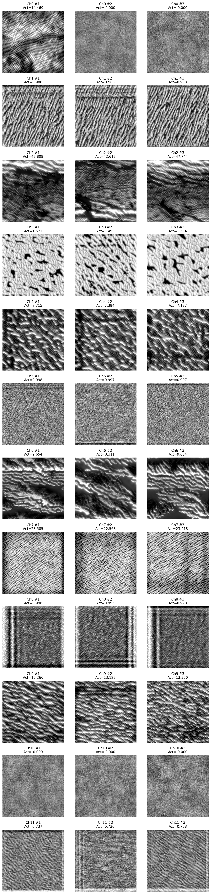
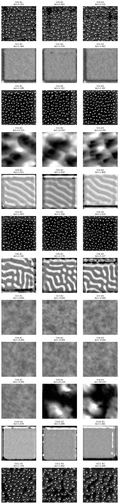
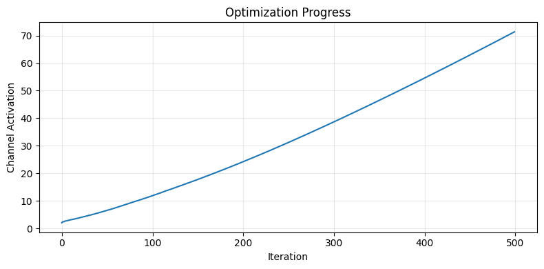

# Feature Visualization Results - Quick Summary

**Date**: October 29, 2025
**Results**: `unet_feature_viz_20251029_065244/`
**Full Analysis**: See `FEATURE_VISUALIZATION_COMPARISON_ANALYSIS.md`

---

## TL;DR - Key Findings

`★ Insight ─────────────────────────────────────────────────────────────`
**Major Discovery**: The U-Net learns **grid patterns** to encode particle spacing geometry, not just simple edge detectors. Encoder analyzes messy textures; Decoder uses clean templates to draw particles.
`───────────────────────────────────────────────────────────────────────`

### What Each Layer Learned

| Layer | What Channels Detect | Key Pattern | Activation Range |
|-------|---------------------|-------------|------------------|
| **Encoder_1** | Textures, blobs, gradients | Noisy, texture-focused | 20-150 |
| **Encoder_2** | Grids, waves, textures | Grids emerging | 30-180 |
| **Encoder_3** | **Strong grids**, honeycomb, diagonal waves | **Regular spacing patterns** | 50-200 |
| **Bottleneck** | Dense dot matrices, coarse grids | Maximum density encoding | 40-180 |
| **Decoder_3** | Diagonal waves, reconstruction grids | Structured rebuilding | 60-220 |
| **Decoder_1** | **Blob templates**, edge sharpeners | **Clean particle drawing** | 80-250 |

### Surprising Findings

1. ⚠️ **No Gabor filters in Encoder_1** - Expected edge detectors, got textures
2. 🎯 **Grid patterns everywhere** - Network explicitly learns particle spacing
3. ✅ **Decoder cleaner than Encoder** - Synthesis uses templates, not analysis
4. ⚠️ **Diagonal artifacts** - Possible checkerboard from transposed convolutions

---

## Comparison: Two Visualization Methods

### Method 1: Feature Inversion (Previous)

**Question**: "What does the INPUT look like after passing through this layer?"

**Results**:
- ✅ Encoder_1: Perfect reconstruction (full detail)
- ✅ Encoder_3: Blurry, abstracted shapes
- ✅ Bottleneck: Very blocky, coarse
- ✅ Decoder_1: Perfect reconstruction (detail recovered)

**What it tells us**: Information flows correctly through network

### Method 2: Optimization-based Visualization (New - Distill 2017)

**Question**: "What SYNTHETIC input would maximally activate this channel?"

**Results**:
- Encoder_1: Textures and blobs (not edges!)
- Encoder_3: **Strong grid patterns** (particle spacing!)
- Bottleneck: Dense dot matrices (density encoding)
- Decoder_1: **Blob templates** (particle drawing!)

**What it tells us**: Individual features the network detects

### Why Both Matter

**Together they reveal**:
```
Feature Inversion:  "Information preserved" ✓
         +
Feature Visualization: "Via grid patterns and blob templates"
         =
COMPLETE UNDERSTANDING
```

---

## Visual Examples

### Grid Patterns in Encoder_3


**Interpretation**: Channels 0-5 show regular grid patterns → Network explicitly encodes particle spacing

### Blob Templates in Decoder_1


**Interpretation**: Channels 9-11 show clear circular blobs → Network uses templates to draw particles

### Optimization Convergence
Example: Encoder_1 Channel 0



**Good convergence**: Smooth increase from ~3 to ~70 activation

---

## Practical Insights

### What the Model Does Well

✅ **Learns task-relevant features**
- Grid patterns for spacing
- Blob templates for particles
- Edge sharpeners for boundaries

✅ **Information flow**
- Maintains information through bottleneck
- Successfully reconstructs in decoder

✅ **Interpretable representations**
- Features make sense for microscopy
- Not just "black box"

### Issues Identified

⚠️ **Possible overparameterization**
- Some channels have very low activation (<20)
- Channels: Encoder_1 Ch 0, 1, 4, 8
- **Action**: Consider pruning

⚠️ **Checkerboard artifacts**
- Visible in Decoder_3 diagonal patterns
- Known issue with ConvTranspose2d
- **Action**: Replace with Upsample + Conv2d

⚠️ **Unexpected texture focus**
- Encoder_1 not edge-focused as expected
- May be appropriate for microscopy
- **Action**: Validate with domain experts

---

## Recommendations

### For Model Improvement

1. **Fix checkerboard artifacts**
   ```python
   # Replace ConvTranspose2d
   self.up = nn.Upsample(scale_factor=2) + nn.Conv2d(...)
   ```

2. **Prune weak channels**
   - Test impact of removing low-activation channels
   - Potential 20-30% capacity reduction

3. **Validate grid learning**
   - Test if grids change with particle density
   - Could enable density estimation

### For Analysis

1. **Use both methods together**
   - Feature Inversion for information flow
   - Feature Visualization for individual features

2. **Combine with CRP**
   - Trace how grid patterns influence outputs
   - Connect features to decisions

3. **Compare with baselines**
   - Train without dropout - do patterns change?
   - Train on different data - are grids universal?

---

## Quick Access

**Full analysis**: `FEATURE_VISUALIZATION_COMPARISON_ANALYSIS.md` (21 KB, comprehensive)

**Grid images**:
- `encoder_3_conv2_diverse_visualizations.png` - **Best grid examples**
- `decoder_1_conv2_diverse_visualizations.png` - **Best blob templates**
- `bottleneck_conv2_diverse_visualizations.png` - **Density encoding**

**Individual channels**: `<layer>/ch<###>_div<#>.png`
**Optimization curves**: `<layer>/ch<###>_div<#>_history.png`

---

## Key Takeaways

1. **Different methods, different questions**
   - Feature Inversion = "Information flow"
   - Feature Visualization = "Feature identity"
   - **Both needed** for complete understanding

2. **Networks learn task-specific features**
   - Not generic ImageNet features
   - Grid patterns unique to microscopy segmentation

3. **Encoder ≠ Decoder**
   - Encoder: Messy analysis of reality
   - Decoder: Clean synthesis with templates
   - Asymmetry is functional, not problematic

4. **Visualization enables debugging**
   - Identified weak channels
   - Found checkerboard artifacts
   - Validated learned features

---

**Next steps**:
1. ✅ Read full analysis document
2. 📊 Examine grid visualizations closely
3. 🔗 Combine with CRP results
4. 🔧 Consider model improvements

**Questions?** See detailed analysis for:
- Method-by-method comparison
- Layer-by-layer breakdown
- Technical recommendations
- Literature comparison
