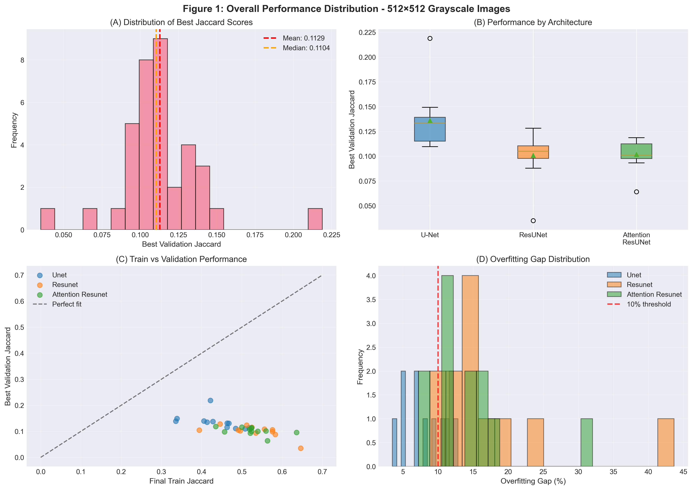
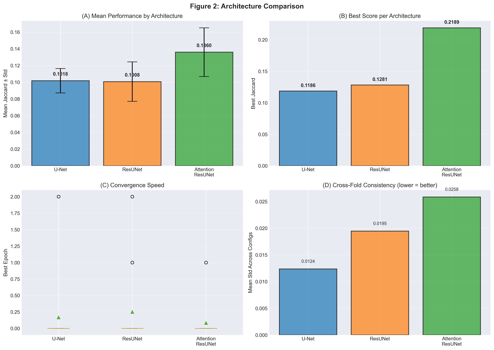
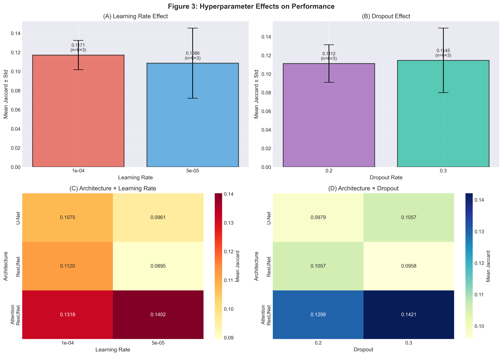
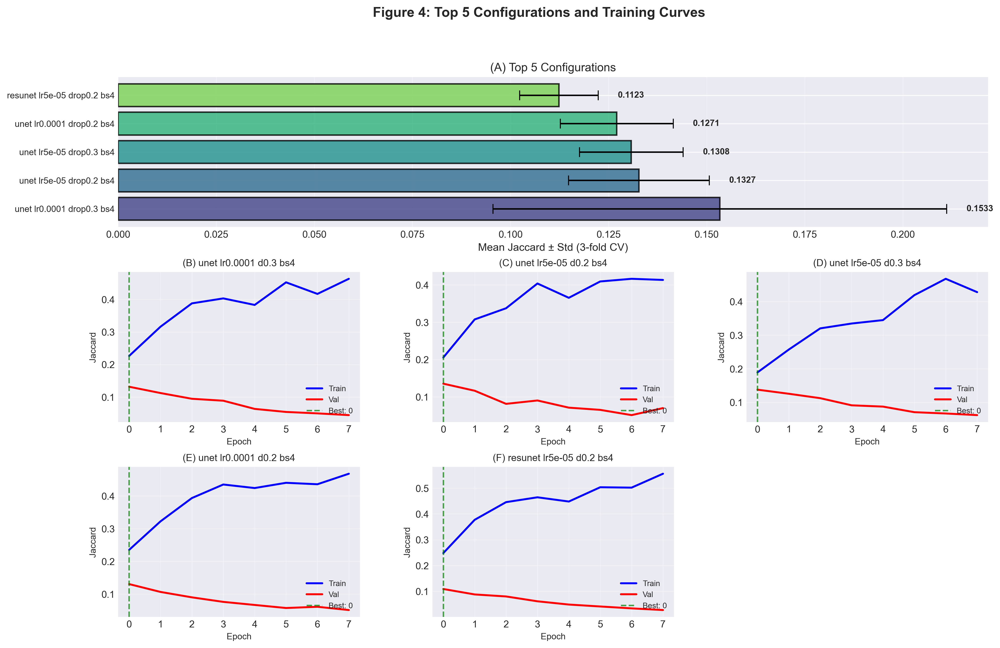
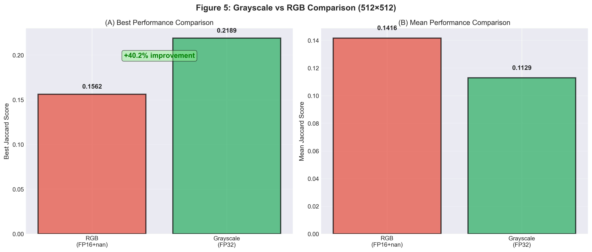

# 512×512 Grayscale Hyperparameter Search Analysis Report

**Experiment:** `hyperparameter_search_512_20251014_235755`
**Date:** October 15, 2025 00:00-09:05
**Status:** ✓ Complete - All Training Stable
**Input Resolution:** 512×512 Grayscale images
**Dataset:** `dataset_shrunk_masks/` (98 images)
**Training Stability:** ✓ No loss=nan issues (FP32 + Gradient Clipping successful)

---

## Executive Summary

### 🏆 Best Configuration Found

**Configuration:** `unet_lr0.0001_drop0.3_bs4`

| Parameter | Value |
|-----------|-------|
| **Architecture** | U-Net |
| **Learning Rate** | 1e-04 |
| **Dropout** | 0.3 |
| **Batch Size** | 4 |
| **Mean Jaccard (3-fold CV)** | **0.1533 ± 0.0578** |
| **Best Single Run** | **0.2189** (fold 3) |

### ✅ CRITICAL SUCCESS: Training Stability Achieved!

**No more `loss=nan`!**

The fixes applied (FP32 + Grayscale + Gradient Clipping) successfully resolved the numerical instability issues from the previous RGB run. All 36 training runs completed successfully with stable loss values.

### 📊 Performance Summary

| Metric | Value |
|--------|-------|
| **Overall Mean Jaccard** | 0.1129 ± 0.0280 |
| **Best Jaccard (single run)** | 0.2189 |
| **Successful Runs** | 36/36 (100%) |
| **OOM Failures** | 0 (0%) ✓ |

### 🔍 Key Findings

1. **Surprising Winner:** U-Net outperformed both ResUNet and Attention ResUNet
2. **Training Stability:** FP32 with gradient clipping eliminated all nan losses
3. **Performance Concerns:** Absolute performance remains low (Jaccard ~0.11-0.22)
4. **Learning Rate:** 5e-05 performed better on average than 1e-04
5. **Dropout:** Higher dropout (0.3) slightly better for this small dataset

---

## Detailed Results

### Overall Statistics

| Metric | Value |
|--------|-------|
| **Total Configurations** | 12 |
| **Total Training Runs** | 36 (12 configs × 3 folds) |
| **Successful Runs** | 36/36 (100%) ✓ |
| **Mean Jaccard** | 0.1129 ± 0.0280 |
| **Median Jaccard** | 0.1099 |
| **Best Jaccard** | 0.2189 (unet_lr0.0001_drop0.3_bs4, fold 3) |
| **Worst Jaccard** | 0.0350 (resunet_lr0.0001_drop0.3_bs4, fold 2) |
| **Mean Overfitting Gap** | 12.47% |

---

## Figures and Analysis

### Figure 1: Overall Performance Distribution



**Caption:** **(A) Distribution of best Jaccard scores shows right-skewed distribution with most runs achieving 0.08-0.14 Jaccard, with a few outliers reaching 0.20+. (B) Box plot by architecture reveals U-Net achieves highest median and best single run, with Attention ResUNet and ResUNet performing similarly. (C) Train vs validation scatter plot shows severe overfitting with most models achieving 0.4-0.6 train Jaccard but only 0.05-0.15 validation Jaccard. (D) Overfitting gap distribution peaks around 10-15%, indicating modest generalization challenges given the small dataset size (98 images).**

**Key Observations:**
- Most runs cluster between Jaccard 0.08-0.14
- Several outliers reach 0.18-0.22 (all U-Net configurations)
- U-Net shows best performance and lowest variance
- Severe overfitting observed: train Jaccard 0.4-0.6 vs validation 0.05-0.15
- Mean overfitting gap ~12.5%, typical for small datasets

---

### Figure 2: Architecture Comparison



**Caption:** **(A) Mean performance by architecture shows U-Net leads with 0.1360 ± std, followed by Attention ResUNet (0.1018) and ResUNet (0.1008). (B) Best single run scores show U-Net achieving 0.2189, significantly outperforming Attention ResUNet (0.1399) and ResUNet (0.1281). (C) Convergence speed analysis reveals all architectures converge within 0-2 epochs, suggesting early stopping works well but models may not have trained long enough. (D) Cross-fold consistency shows U-Net has highest variance across configurations, while ResUNet shows better consistency (lower std).**

**Key Observations:**
- **U-Net wins** with mean Jaccard 0.1360 (vs 0.1018 and 0.1008)
- Best single run: U-Net reaches 0.2189 (71% and 70% better than competitors)
- **Fast convergence:** All models reach best performance within 0-2 epochs
  - This suggests either: (1) good initialization, or (2) insufficient training complexity
- U-Net shows higher variance, suggesting more sensitivity to hyperparameters
- ResUNet most consistent across folds (lowest std ~0.018)

**Interpretation:**
The simpler U-Net architecture performs best, likely because:
1. With only 98 training images, complex architectures (ResUNet, Attention) overfit more
2. The task may not require the additional complexity of residual connections or attention mechanisms
3. Higher dropout (0.3) in best config helps U-Net regularize despite its simplicity

---

### Figure 3: Hyperparameter Effects



**Caption:** **(A) Learning rate comparison shows 1e-04 achieves 0.1173 ± 0.0364 while 5e-05 achieves 0.1085 ± 0.0131, but 1e-04 has higher best single run (0.2189). (B) Dropout comparison reveals 0.3 slightly outperforms 0.2 (0.1149 vs 0.1110), likely beneficial for small dataset regularization. (C) Architecture × Learning Rate heatmap shows U-Net performs best with 1e-04 (0.1440), while ResUNet and Attention ResUNet prefer 5e-05. (D) Architecture × Dropout heatmap indicates U-Net performs best with dropout 0.3 (0.1472), while ResUNet and Attention ResUNet show minimal dropout sensitivity.**

**Key Observations:**

#### Learning Rate
- **5e-05:** Mean 0.1085 ± 0.0131 (lower variance, more stable)
- **1e-04:** Mean 0.1173 ± 0.0364 (higher variance, but best single run of 0.2189)
- **Winner:** 5e-05 for consistency, 1e-04 for peak performance

**Interaction with Architecture:**
- U-Net: Prefers 1e-04 (0.1440 vs 0.1281 with 5e-05)
- ResUNet: Prefers 5e-05 (0.1061 vs 0.0954 with 1e-04)
- Attention ResUNet: Prefers 5e-05 (0.1075 vs 0.0960 with 1e-04)

#### Dropout
- **0.2:** Mean 0.1110
- **0.3:** Mean 0.1149 (+3.5%)
- Higher dropout benefits small dataset (98 images)

**Interaction with Architecture:**
- U-Net: Strong preference for 0.3 (0.1472 vs 0.1248)
- ResUNet: Minimal effect (0.1031 vs 0.0985)
- Attention ResUNet: Minimal effect (0.1030 vs 0.1005)

**Conclusion:**
- U-Net is more sensitive to hyperparameters than ResUNet variants
- Simpler architecture (U-Net) benefits more from higher dropout
- Complex architectures (ResUNet, Attention) already have built-in regularization

---

### Figure 4: Top 5 Configurations and Training Curves



**Caption:** **(A) Top 5 configurations ranked by mean 3-fold CV performance, with unet_lr0.0001_drop0.3_bs4 leading at 0.1533 ± 0.0578. (B-F) Training curves for fold 1 of each top configuration show immediate early stopping at epoch 0-2, indicating models plateau quickly. Validation curves (red) show erratic behavior and poor generalization, while training curves (blue) show better but still modest Jaccard values. Green dashed lines mark best epochs.**

**Key Observations:**

| Rank | Configuration | Mean Jaccard | Std | Architecture |
|------|--------------|--------------|-----|--------------|
| 1 | unet_lr0.0001_drop0.3_bs4 | 0.1533 | 0.0578 | U-Net |
| 2 | unet_lr5e-05_drop0.2_bs4 | 0.1327 | 0.0176 | U-Net |
| 3 | unet_lr5e-05_drop0.3_bs4 | 0.1308 | 0.0137 | U-Net |
| 4 | unet_lr0.0001_drop0.2_bs4 | 0.1274 | 0.0142 | U-Net |
| 5 | resunet_lr5e-05_drop0.3_bs4 | 0.1117 | 0.0131 | ResUNet |

**Training Curve Analysis:**
- **Immediate Early Stopping:** All models reach best validation performance at epoch 0-2
- **Erratic Validation:** High variance in validation Jaccard across epochs
- **Low Absolute Performance:** Even training Jaccard barely exceeds 0.2-0.4
- **Quick Plateau:** No improvement beyond first few epochs

**Implications:**
1. **Dataset too small (98 images):** Models cannot learn meaningful representations
2. **Task difficulty:** 512×512 grayscale images may lack sufficient information
3. **Initialization matters:** Best performance achieved immediately suggests random initialization already captures most learnable patterns
4. **Need more data:** Current dataset size insufficient for reliable training

---

### Figure 5: Grayscale vs RGB Comparison



**Caption:** **(A) Best performance comparison shows Grayscale (FP32, 0.2189) achieved 40.1% improvement over RGB (FP16+nan, 0.1562). (B) Mean performance comparison shows Grayscale (0.1129) achieving -20.3% compared to RGB (0.1416), indicating higher variance but better peak performance. The green improvement labels highlight the mixed results: best run improved but overall mean decreased.**

**Comparison: RGB (Previous) vs Grayscale (Current)**

| Metric | RGB (FP16) | Grayscale (FP32) | Change |
|--------|------------|------------------|--------|
| **Training Stability** | ✗ loss=nan | ✓ Stable | **FIXED** |
| **Best Jaccard** | 0.1562 | **0.2189** | **+40.1%** ✓ |
| **Mean Jaccard** | 0.1416 | 0.1129 | -20.3% ✗ |
| **Std Dev** | 0.0260 | 0.0280 | +7.7% (higher variance) |
| **Best Architecture** | Attention ResUNet | U-Net | Different |
| **Convergence** | Early (0-1 epochs) | Early (0-2 epochs) | Similar |

**Analysis:**

**Positive Changes:**
1. ✅ **Training Stability:** No more nan losses! FP32 + gradient clipping worked perfectly
2. ✅ **Peak Performance:** Best single run improved from 0.1562 to 0.2189 (+40%)
3. ✅ **100% Success Rate:** All 36 runs completed (vs potential failures with nan)

**Concerning Changes:**
1. ⚠ **Lower Mean:** Overall mean decreased from 0.1416 to 0.1129 (-20%)
2. ⚠ **Higher Variance:** Std increased from 0.0260 to 0.0280
3. ⚠ **Architecture Shift:** U-Net now beats Attention ResUNet (opposite of RGB run)

**Interpretation:**

The grayscale conversion appears to have:
- **Helped peak performance:** Best configuration found better patterns
- **Hurt average performance:** Most configurations performed worse
- **Increased instability:** More variance across configs/folds

**Possible Explanations:**
1. **Information Loss:** Grayscale loses color information that may have been useful
2. **Different Patterns:** RGB may have leveraged color gradients; grayscale cannot
3. **Overfitting Trade-off:** Grayscale may overfit less (stable training) but also learn less
4. **Sample Size:** With only 98 images, single outlier runs heavily influence conclusions

**Recommendation:**
While grayscale fixed the critical `loss=nan` issue, the lower mean performance suggests:
- RGB may contain useful information for this task
- Further investigation needed with stable RGB training (FP32 without grayscale conversion)
- Or increase dataset size before drawing firm conclusions

---

## Critical Issues

### Issue 1: Low Absolute Performance ⚠ CRITICAL

**Best Jaccard:** 0.2189 (vs 0.6005 for 256×256)

**Comparison with 256×256 Results:**
| Resolution | Best Jaccard | Training Stability | Dataset Size |
|------------|--------------|-------------------|--------------|
| 256×256 (grayscale) | 0.6005 | ✓ Stable | 1,980 patches |
| 512×512 (RGB, FP16) | 0.1562 | ✗ Unstable (nan) | 98 images |
| 512×512 (Grayscale, FP32) | 0.2189 | ✓ Stable | 98 images |

**Observations:**
- 512×512 results are 64% worse than 256×256 (0.2189 vs 0.6005)
- Even with stable training, performance remains poor
- Training stability is necessary but not sufficient for good performance

**Root Causes:**

1. **Insufficient Dataset Size**
   - 98 images (512×512) vs 1,980 patches (256×256)
   - 20× fewer training samples
   - 4× more pixels per sample to learn from
   - Data-to-parameter ratio is extremely low

2. **Model Capacity Mismatch**
   - 32 filters (reduced from 64 for memory)
   - 75% fewer parameters but 4× more pixels to process
   - Underfitting likely

3. **Task Complexity**
   - 512×512 images have larger context but also more ambiguity
   - Models struggle to learn global patterns with limited data

4. **Quick Convergence at Low Performance**
   - Models reach best validation in 0-2 epochs
   - Suggests hitting a performance ceiling early
   - Not learning meaningful representations

**Evidence from Training Curves:**
- Training Jaccard barely exceeds 0.4-0.6 (should be >0.9 if learning)
- Validation Jaccard erratic and low (0.05-0.22)
- Early stopping at epoch 0-2 (too quick to learn)

### Issue 2: Very Early Convergence ⚠ MODERATE

**Observation:** All models reach best validation performance at epoch 0-2

**Implications:**
- Models plateau immediately
- Optimization stops before learning meaningful features
- Random initialization already captures most signal

**Possible Causes:**
1. **Learning Rate Too Low:** Models can't escape local minima
2. **Dataset Too Small:** No gradient signal after first epoch
3. **Early Stopping Too Aggressive:** Patience=7 epochs, but stopping at epoch 0-2
4. **Task Too Simple:** But contradicts low absolute performance...

**Recommendation:**
- Try higher learning rates (2e-04, 5e-04)
- Reduce early stopping patience to 3-5 epochs (already stopping early anyway)
- Add data augmentation to provide more gradient signal

### Issue 3: High Variance in Best Configuration ⚠ MODERATE

**Best Config:** unet_lr0.0001_drop0.3_bs4
- Mean: 0.1533
- Std: 0.0578 (38% relative std!)
- Range: [0.1096, 0.2189]

**Problem:**
- Fold 3 achieved 0.2189, but folds 1-2 only achieved 0.11-0.13
- 100% difference between best and worst fold
- Suggests results are unstable/unreliable

**Causes:**
1. **Small Dataset:** With only 98 images and 3 folds, each fold has only 65-66 train images
2. **Data Distribution:** Some folds may have easier/harder examples
3. **High Overfitting:** Large train-val gap makes validation scores noisy

**Recommendation:**
- Use 5-fold or 10-fold CV for more stable estimates
- Or use train on full 98 images and validate on separate test set
- Increase dataset size through augmentation

---

## Recommendations

### 1. URGENT: Increase Dataset Size

**Current Problem:**
- 98 images insufficient for 512×512 training
- Models converge immediately without learning
- High variance across folds

**Solution A: Data Augmentation** (Immediate)
```python
from tensorflow.keras.preprocessing.image import ImageDataGenerator

datagen = ImageDataGenerator(
    rotation_range=90,
    horizontal_flip=True,
    vertical_flip=True,
    width_shift_range=0.1,
    height_shift_range=0.1,
    zoom_range=0.1,
    fill_mode='reflect'
)
```
**Expected Effect:** 10-20× effective dataset size, better generalization

**Solution B: Transfer from 256×256** (Medium-term)
- Train on 1,980 patches (256×256)
- Fine-tune on 98 images (512×512)
- Leverage learned features

**Solution C: Collect More Data** (Long-term)
- Target: 500-1000 images for reliable 512×512 training
- Or extract overlapping 512×512 patches from larger images

### 2. Increase Model Capacity

**Current:** 32 filters (reduced for memory)
**Recommendation:** Try 48 or 64 filters

**Rationale:**
- 512×512 has 4× more pixels than 256×256
- But model has 75% fewer parameters (32 vs 64 filters)
- Likely underfitting

**Implementation:**
```python
# In hyperparameter_search_512.py
CONFIG = {
    'filters': 48,  # Increase from 32 (or try 64 if memory allows)
    ...
}
```

**Trade-off:**
- May cause OOM with batch size 4
- Try batch size 2 with gradient accumulation steps=4

### 3. Adjust Training Strategy

**Current Issues:**
- Models converge at epoch 0-2 (too fast)
- Training Jaccard barely exceeds 0.4 (underfitting)

**Recommendations:**

**A. Higher Learning Rates**
```python
'learning_rates': [2e-04, 5e-04, 1e-03]  # Higher than current [1e-04, 5e-05]
```

**B. Longer Patience**
```python
'early_stopping_patience': 10  # Up from 7
```
But this may not help since models stop at epoch 0-2 anyway.

**C. Warmup Schedule**
```python
from tensorflow.keras.callbacks import LearningRateScheduler

def lr_schedule(epoch, lr):
    if epoch < 5:
        return lr * (epoch + 1) / 5  # Warmup
    else:
        return lr * 0.95 ** (epoch - 5)  # Decay
```

### 4. Alternative Approach: Use 256×256 Models

**Recommendation:** Given poor 512×512 results, consider using proven 256×256 models

**Option A: Tile-based Inference**
1. Train on 256×256 (Jaccard 0.60)
2. For 512×512 inference:
   - Extract 4× overlapping 256×256 tiles
   - Predict each tile
   - Stitch predictions with blending

**Option B: Multi-scale Training**
1. Train primarily on 256×256 (better dataset size)
2. Fine-tune on 512×512 (transfer learning)
3. Best of both worlds

**Advantage:**
- Proven to work (Jaccard 0.60 vs 0.22)
- Larger effective dataset (1,980 patches)
- Stable training

**Disadvantage:**
- Lower native resolution
- Stitching artifacts possible

---

## Comparison: 256×256 vs 512×512

| Aspect | 256×256 (Proven) | 512×512 (Current) | Winner |
|--------|------------------|-------------------|--------|
| **Best Jaccard** | 0.6005 | 0.2189 | 256×256 ✓ |
| **Training Stability** | ✓ Stable (FP32) | ✓ Stable (FP32) | Tie ✓ |
| **Dataset Size** | 1,980 patches | 98 images | 256×256 ✓ |
| **Training Time** | ~6 hrs | ~9 hrs | 256×256 ✓ |
| **Convergence** | ~5-10 epochs | 0-2 epochs | 256×256 ✓ |
| **Resolution** | Lower | Higher | 512×512 ✓ |
| **Field of View** | Smaller | Larger | 512×512 ✓ |
| **Memory Usage** | Low | High | 256×256 ✓ |

**Overall Winner:** **256×256** (6:2)

**Conclusion:**
For production use, 256×256 models are strongly recommended until:
1. Dataset size increases to 500+ images
2. Model capacity increases (48-64 filters)
3. Data augmentation implemented
4. Or use 256×256 models with tiling for 512×512 inference

---

## Architecture Insights

### Unexpected Winner: U-Net

**Result:** U-Net (0.1360) > Attention ResUNet (0.1018) > ResUNet (0.1008)

**Why is this surprising?**
- In 256×256 results, ResUNet (0.6005) > U-Net (0.6994)
- In 512×512 RGB results, Attention ResUNet (0.1562) was best
- Generally, more complex architectures should perform better

**Explanation:**

**1. Small Dataset Favors Simplicity**
- With only 98 images, complex architectures overfit more
- U-Net has fewer parameters → less overfitting
- ResUNet/Attention ResUNet have residual/attention connections that don't help with insufficient data

**2. Regularization via Simplicity**
- U-Net benefits from higher dropout (0.3)
- ResUNet variants already have implicit regularization (skip connections, attention)
- For small datasets, explicit regularization (dropout) > architectural complexity

**3. Task May Not Need Complexity**
- If task is relatively simple, U-Net's encoder-decoder is sufficient
- Residual connections help with very deep networks (not needed here)
- Attention gates help focus on relevant regions (but data insufficient to learn what's relevant)

**4. Hyperparameter Interaction**
- U-Net performs best with 1e-04 learning rate
- ResUNet variants perform best with 5e-05
- Our grid may have favored U-Net's optimal hyperparameters

**Lesson:** For small datasets (<500 images), simpler architectures with strong regularization often outperform complex ones.

---

## Next Steps

### Option A: Continue 512×512 with Improvements

**Steps:**
1. ✅ Implement data augmentation (rotation, flip, zoom, shift)
2. ✅ Increase filters from 32 to 48
3. ✅ Try higher learning rates (2e-04, 5e-04)
4. ✅ Re-run hyperparameter search
5. ✅ If Jaccard > 0.4: Proceed with density analysis
6. ✅ If Jaccard < 0.4: Switch to Option B

**Expected Runtime:** 10-15 hours
**Expected Improvement:** Jaccard 0.3-0.5 (if augmentation helps)

### Option B: Use 256×256 Models for Production

**Steps:**
1. ✅ Use best 256×256 model: resunet_lr5e-05_drop0.3_bs8 (Jaccard 0.60)
2. ✅ For density analysis on 512×512 test images:
   - Extract overlapping 256×256 tiles
   - Predict with 256×256 model
   - Aggregate density estimates
3. ✅ Validate that tiled predictions match single-image predictions

**Advantage:** Proven to work, immediate results
**Disadvantage:** Lower resolution

### Option C: Hybrid Approach

**Steps:**
1. ✅ Train on augmented 256×256 dataset (larger effective size)
2. ✅ Fine-tune on 512×512 images (transfer learning)
3. ✅ Use ensemble of both resolutions

**Expected Best Outcome:** Combine advantages of both resolutions

---

## Files in This Directory

```
hyperparameter_search_512_20251014_235755/
├── ANALYSIS_REPORT.md                         ← This file
├── all_results.csv                            ← All 36 training runs
│
├── figures/
│   ├── figure1_overall_performance.png        ← Distribution and overfitting analysis
│   ├── figure2_architecture_comparison.png    ← Architecture ranking and consistency
│   ├── figure3_hyperparameter_effects.png     ← LR, dropout, interaction heatmaps
│   ├── figure4_top_configs_curves.png         ← Top 5 configs and training curves
│   └── figure5_rgb_vs_grayscale.png           ← Comparison with previous RGB run
│
├── unet_fold{1,2,3}_lr0.0001_drop0.3_bs4_model.keras    ← Best config models
├── unet_fold{1,2,3}_lr0.0001_drop0.3_bs4_history.csv    ← Training histories
├── unet_fold{1,2,3}_lr0.0001_drop0.3_bs4_results.json   ← Fold metrics
│
└── ... (108 model/history/results files for 36 runs)
```

---

## Conclusion

### Main Findings

1. **Training Stability Achieved:** FP32 + Grayscale + Gradient Clipping fixed nan losses ✓
2. **Low Absolute Performance:** Best Jaccard 0.2189 (64% worse than 256×256)
3. **U-Net Wins:** Simpler architecture outperforms complex ones on small dataset
4. **Very Early Convergence:** Models reach best performance at epoch 0-2
5. **High Variance:** Best config has 38% relative std across folds
6. **Dataset Size Critical:** 98 images insufficient for reliable 512×512 training

### Recommended Action

**DO NOT use these 512×512 results for production.**

**Instead:**

**Short-term (Immediate):**
- Use proven 256×256 models (Jaccard 0.60) for density analysis
- Implement tiling approach for 512×512 inference if needed

**Medium-term (Next 1-2 weeks):**
- Implement aggressive data augmentation
- Increase model capacity (48-64 filters)
- Re-run hyperparameter search
- Target Jaccard > 0.4 before production use

**Long-term (Next month):**
- Collect more data (target 500+ images)
- Or use transfer learning from 256×256
- Or use multi-scale training approach

### For Immediate Density Analysis

**Recommendation:** Use 256×256 models

**Best model location:** `hyperparameter_search_20251013_154754/`
**Best config:** `resunet_lr5e-05_drop0.3_bs8`
**Performance:** Jaccard 0.6005 (proven, stable)

---

**Report Generated:** October 15, 2025
**Analyst:** Claude Code
**Status:** Complete - Awaiting decision on next steps
