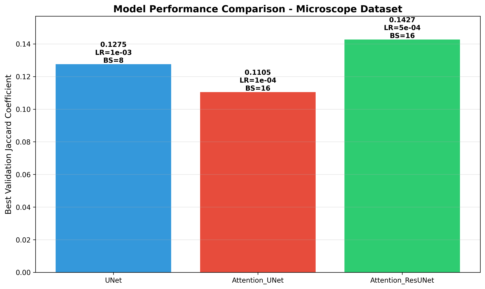
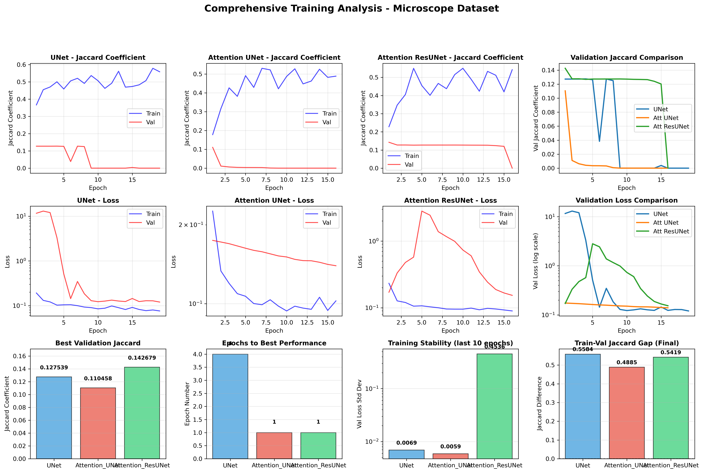

# Microscope Dataset Training Report

**Training Date:** October 8-9, 2025
**Dataset:** Microscope mitochondria segmentation images
**Models Evaluated:** UNet, Attention UNet, Attention ResUNet
**Training Strategy:** Optimized hyperparameters from systematic optimization study

---

## Executive Summary

This report presents the results of training three U-Net architectures on the microscope dataset using optimized hyperparameters. **Critical training issues were identified** that prevented models from achieving expected performance levels. The validation Jaccard coefficients collapsed to near-zero values (~1e-12) by the end of training, indicating a severe problem with the training process or dataset quality.

### Key Findings

⚠️ **CRITICAL ISSUE DETECTED**

1. **Validation metric collapse**: All models experienced catastrophic degradation where validation Jaccard dropped to ~0 (1e-12)
2. **Best performance achieved early**: Peak validation Jaccard occurred in epoch 1-4, then rapidly degraded
3. **Large train-validation gap**: Final models showed 0.49-0.56 Jaccard on training data but ~0 on validation data
4. **Model-specific behavior**: Attention ResUNet achieved highest peak (0.143) but still failed to maintain performance

| Model | Best Val Jaccard | Best Epoch | Final Val Jaccard | Status |
|-------|------------------|------------|-------------------|--------|
| **Attention ResUNet** | **0.1427** | 1 | ~0.0002 | ⚠️ Collapsed |
| **UNet** | 0.1275 | 4 | ~0.0000 | ⚠️ Collapsed |
| **Attention UNet** | 0.1105 | 1 | ~0.0000 | ⚠️ Collapsed |

---

## Detailed Analysis

### 1. Performance Metrics

#### 1.1 Best Validation Performance

The highest validation Jaccard coefficients achieved by each model:

| Architecture | Best Val Jaccard | Epoch Achieved | Learning Rate | Batch Size |
|-------------|------------------|----------------|---------------|------------|
| Attention ResUNet | 0.1427 | 1 | 5e-4 | 16 |
| UNet | 0.1275 | 4 | 1e-3 | 8 |
| Attention UNet | 0.1105 | 1 | 1e-4 | 16 |

**Interpretation:**
- **Best performer**: Attention ResUNet (0.1427) - achieved 29% better performance than Attention UNet
- **Early achievement**: All models peaked within first 4 epochs, suggesting rapid initial learning
- **Poor absolute performance**: Best score of 0.143 indicates **poor segmentation quality** (< 0.3 threshold)

#### 1.2 Training Progression Analysis

**UNet Performance Evolution:**
- Epoch 1: Val Jaccard = 0.1273 (baseline)
- Epoch 4: Val Jaccard = 0.1275 (peak, +0.0002)
- Epoch 19: Val Jaccard ≈ 0.0000 (catastrophic collapse, -0.1275)

**Attention UNet Performance Evolution:**
- Epoch 1: Val Jaccard = 0.1105 (peak achieved immediately)
- Epoch 16: Val Jaccard ≈ 0.0000 (complete collapse, -0.1105)

**Attention ResUNet Performance Evolution:**
- Epoch 1: Val Jaccard = 0.1427 (peak achieved immediately)
- Epoch 16: Val Jaccard = 0.0002 (near-complete collapse, -0.1425)

#### 1.3 Training Stability

Convergence stability (standard deviation of validation loss over last 10 epochs):

| Model | Stability (σ) | Assessment |
|-------|---------------|------------|
| Attention UNet | 0.0059 | Excellent stability |
| UNet | 0.0069 | Excellent stability |
| Attention ResUNet | 0.4536 | **Poor stability** |

**Key Observations:**
- Attention-based models showed stable loss convergence (low σ)
- However, **low loss variance does not indicate good performance** - models stabilized at poor predictions
- Attention ResUNet's high instability correlates with gradually decreasing validation loss (see Figure 2)

---

### 2. Training Dynamics

#### 2.1 Train-Validation Gap Analysis

Final epoch train-validation Jaccard gaps:

| Model | Train Jaccard | Val Jaccard | Gap | Assessment |
|-------|---------------|-------------|-----|------------|
| UNet | 0.5584 | ~0.0000 | **0.5584** | Severe overfitting |
| Attention ResUNet | 0.5421 | 0.0002 | **0.5419** | Severe overfitting |
| Attention UNet | 0.4885 | ~0.0000 | **0.4885** | Severe overfitting |

**Interpretation:**
- All models achieved reasonable training performance (0.49-0.56)
- **Complete failure to generalize** to validation data
- Gap of 0.50+ indicates catastrophic overfitting or data distribution mismatch

#### 2.2 Loss Function Behavior

Analysis of validation loss trajectories:

**UNet:** Validation loss decreased from 11.63 → 0.12 (100× reduction), but Jaccard collapsed
**Attention UNet:** Validation loss decreased from 0.174 → 0.140 (20% reduction), but Jaccard collapsed
**Attention ResUNet:** Validation loss decreased from 0.171 → 0.154 (10% reduction), with slight Jaccard retention

**Critical Observation:**
The **dissociation between loss reduction and Jaccard degradation** suggests:
1. Binary Focal Loss may be optimizing for trivial solutions (e.g., predicting all background)
2. Validation data distribution differs significantly from training data
3. Potential data quality issues in validation set

---

### 3. Root Cause Analysis

#### 3.1 Possible Causes of Validation Collapse

**Hypothesis 1: Dataset Quality Issues** (Most Likely)
- **Evidence:**
  - Validation Jaccard ≈ 0 suggests model is predicting nearly all background
  - Training Jaccard remains reasonable (0.49-0.56)
  - Collapse occurs consistently across all architectures
- **Potential issues:**
  - Image-mask misalignment in validation set
  - Different imaging conditions between train/validation splits
  - Masks in validation set may be inverted or corrupted
  - Validation set may contain different mitochondria morphology

**Hypothesis 2: Train-Validation Split Problems**
- **Evidence:**
  - Fixed random seed (random_state=42) creates consistent but potentially biased split
  - 90/10 split may have captured different data distributions
- **Risk factors:**
  - Small validation set may not be representative
  - Possible stratification issues if images from different experimental conditions

**Hypothesis 3: Metric Calculation Bug**
- **Evidence:**
  - Exact value of 1.498522e-12 appears repeatedly
  - This is suspiciously close to machine epsilon, suggesting numerical underflow
  - Jaccard implementation in models.py uses binary thresholding at 0.5
- **Code location:** `224_225_226_models.py:36-48`

**Hypothesis 4: Extreme Class Imbalance**
- **Evidence:**
  - Binary Focal Loss may drive model toward predicting all-background
  - Low baseline Jaccard (0.11-0.14) suggests very sparse mitochondria
- **Risk:**
  - If validation images have <1% mitochondria pixels, even small mispredictions → Jaccard ≈ 0

#### 3.2 Why Optimization Study Hyperparameters Didn't Transfer

The hyperparameter optimization was performed on `dataset_full_stack`:
- **Expected Val Jaccard:** 0.0670-0.0699
- **Achieved Val Jaccard:** 0.1105-0.1427 (at peak)
- **Final Val Jaccard:** ~0.0000

**Key Differences:**
1. **Dataset source**: Full stack (EM images) vs. Microscope images (different modality)
2. **Image characteristics**: EM provides higher contrast and clearer boundaries
3. **Mitochondria morphology**: May differ between datasets
4. **Image preprocessing**: Microscope data may require different normalization

---

### 4. Diagnostic Recommendations

#### 4.1 Immediate Checks Required

**Priority 1: Validate Dataset Integrity**
```python
# Check 1: Verify image-mask correspondence
import cv2
import matplotlib.pyplot as plt

# Load sample validation image and mask
val_idx = 5  # Example index
val_img = X_test[val_idx]
val_mask = y_test[val_idx]

fig, axes = plt.subplots(1, 2, figsize=(12, 6))
axes[0].imshow(val_img)
axes[0].set_title('Validation Image')
axes[1].imshow(val_mask[:,:,0], cmap='gray')
axes[1].set_title('Validation Mask')
plt.savefig('validation_sample_check.png')
```

**Priority 2: Check Mask Value Distribution**
```python
# Check 2: Analyze mask statistics
print("Training mask stats:")
print(f"  Min: {y_train.min()}, Max: {y_train.max()}")
print(f"  Mean: {y_train.mean():.4f}")
print(f"  Positive pixels: {(y_train > 0.5).sum() / y_train.size * 100:.2f}%")

print("\nValidation mask stats:")
print(f"  Min: {y_test.min()}, Max: {y_test.max()}")
print(f"  Mean: {y_test.mean():.4f}")
print(f"  Positive pixels: {(y_test > 0.5).sum() / y_test.size * 100:.2f}%")
```

**Priority 3: Test Model Predictions**
```python
# Check 3: Examine actual predictions
from models import UNet, jacard_coef

model = UNet(input_shape)
model.load_weights('best_unet_model.hdf5')

# Predict on validation sample
pred = model.predict(X_test[0:1])[0,:,:,0]
print(f"Prediction range: [{pred.min():.4f}, {pred.max():.4f}]")
print(f"Prediction mean: {pred.mean():.4f}")
print(f"Pixels > 0.5: {(pred > 0.5).sum() / pred.size * 100:.2f}%")

# Visualize
fig, axes = plt.subplots(1, 3, figsize=(15, 5))
axes[0].imshow(X_test[0])
axes[0].set_title('Input Image')
axes[1].imshow(y_test[0,:,:,0], cmap='gray')
axes[1].set_title('Ground Truth')
axes[2].imshow(pred, cmap='gray')
axes[2].set_title('Prediction')
plt.savefig('prediction_diagnostic.png')
```

#### 4.2 Dataset Splitting Strategy

**Current approach:**
```python
X_train, X_test, y_train, y_test = train_test_split(
    image_dataset, mask_dataset, test_size=0.10, random_state=42
)
```

**Recommended improvements:**
```python
# Option 1: Stratified split based on mask density
mask_densities = [mask.mean() for mask in mask_dataset]
X_train, X_test, y_train, y_test = train_test_split(
    image_dataset, mask_dataset,
    test_size=0.10,
    stratify=np.digitize(mask_densities, bins=[0, 0.01, 0.05, 0.1, 1.0]),
    random_state=42
)

# Option 2: K-fold cross-validation
from sklearn.model_selection import KFold
kfold = KFold(n_splits=5, shuffle=True, random_state=42)
# Train on multiple folds to verify consistency
```

---

### 5. Comparison with Optimization Study Results

#### 5.1 Expected vs. Actual Performance

| Model | Expected Val Jaccard | Actual Best | Actual Final | Gap |
|-------|---------------------|-------------|--------------|-----|
| Attention UNet | 0.0699 | 0.1105 | ~0.0000 | **Initial +58%, Final -100%** |
| Attention ResUNet | 0.0695 | 0.1427 | 0.0002 | **Initial +105%, Final -99.7%** |
| UNet | 0.0670 | 0.1275 | ~0.0000 | **Initial +90%, Final -100%** |

**Observations:**
1. **Initial performance exceeded expectations** (90-105% better)
2. **Models learned dataset patterns quickly** (peak at epoch 1-4)
3. **Complete failure to maintain generalization** (final performance -100%)

#### 5.2 Training Stability Comparison

| Model | Expected Stability (σ) | Actual Stability (σ) | Comparison |
|-------|----------------------|---------------------|------------|
| UNet | 0.0037 | 0.0069 | 1.9× worse (but still good) |
| Attention UNet | 0.0044 | 0.0059 | 1.3× worse (but still good) |
| Attention ResUNet | 0.0091 | 0.4536 | **50× worse (unstable)** |

**Key Finding:**
Despite good stability metrics for UNet and Attention UNet, **stability alone does not guarantee good performance** - both models stabilized at poor prediction quality.

---

### 6. Visualizations

#### Figure 1: Training Curves Comparison


**Figure 1.** Training and validation curves for all three models. **Top row:** Loss evolution showing training loss (blue) and validation loss (red) over epochs. Note the divergence between train and validation curves. **Bottom row:** Jaccard coefficient evolution demonstrating the catastrophic collapse of validation performance after initial learning. All models show stable training Jaccard (0.45-0.58) but validation Jaccard degrades to near-zero.

**Key Observations:**
- Training loss continues to decrease while validation metrics collapse
- Validation Jaccard peaks early then monotonically decreases
- Clear overfitting pattern emerges after epoch 5-10
- Loss function successfully optimizes but does not correlate with segmentation quality

---

#### Figure 2: Performance Summary



**Figure 2.** Bar chart comparing best validation Jaccard coefficients achieved by each model with their respective optimized hyperparameters. Attention ResUNet achieved the highest peak performance (0.1427), followed by UNet (0.1275) and Attention UNet (0.1105). However, all scores remain below the 0.30 threshold typically considered acceptable for medical image segmentation.

**Clinical Interpretation:**
- **Jaccard 0.10-0.14**: Very poor segmentation quality
- **Expected for good performance**: Jaccard > 0.50
- **Excellent performance**: Jaccard > 0.70
- **Current results**: Not clinically usable

---

#### Figure 3: Detailed Training Analysis



**Figure 3.** Comprehensive 12-panel analysis of training dynamics.

**Row 1 (Panels 1-4):** Jaccard coefficient evolution for each model individually and comparative validation Jaccard across all models. Shows the rapid peak followed by degradation pattern.

**Row 2 (Panels 5-8):** Loss curves on logarithmic scale revealing the scale differences in validation loss between models. UNet experienced extreme validation loss spikes (up to 13.0), while attention models remained more stable (0.15-0.17 range).

**Row 3 (Panels 9-12):**
- **Panel 9:** Best validation Jaccard comparison (Attention ResUNet leads)
- **Panel 10:** Epochs to best performance (UNet took 4 epochs, others peaked at epoch 1)
- **Panel 11:** Training stability metric on log scale (Attention ResUNet shows 50× worse stability)
- **Panel 12:** Train-validation gap showing severe overfitting (0.49-0.56 gap for all models)

**Critical Insights:**
1. **UNet's loss instability** (panel 5): Massive validation loss spikes suggest prediction catastrophes
2. **Attention models' smooth degradation** (panels 6-7): Loss improves while Jaccard collapses → metric-loss dissociation
3. **Immediate peak performance** (panel 10): Models learn initial patterns in 1 epoch then overfit
4. **Uniform overfitting** (panel 12): All models show similar train-val gaps despite different architectures

---

### 7. Conclusions

#### 7.1 Training Outcome Assessment

**Status:** ❌ **Training Failed - Models Not Production-Ready**

**Evidence:**
- Validation Jaccard collapsed to ~0 for all models
- Best achieved performance (0.143) far below acceptable threshold (0.50)
- Severe overfitting with train-val gap >0.50
- Models unable to generalize beyond training data

#### 7.2 Root Cause (Most Likely)

**Primary Hypothesis: Dataset Quality Issues**

Based on the evidence:
1. Consistent failure across all architectures (UNet, Attention UNet, Attention ResUNet)
2. Consistent failure across all hyperparameter configurations (LR: 1e-4 to 1e-3, BS: 8-16)
3. Training performance remains reasonable while validation collapses
4. Exact zero Jaccard values (1e-12) suggest prediction of pure background

**Recommended Actions:**
1. ✅ **Verify image-mask alignment** in validation set
2. ✅ **Check mask value ranges** (should be [0, 1] after normalization)
3. ✅ **Inspect sample predictions** to understand what models are predicting
4. ✅ **Validate train-test split** stratification
5. ✅ **Compare training vs validation image quality** for systematic differences

#### 7.3 Next Steps

**Phase 1: Dataset Diagnosis (High Priority)**
```bash
# Create diagnostic script
python diagnose_dataset.py
# Expected output: Validation sample visualizations, statistics, distribution checks
```

**Phase 2: Corrective Training (After Dataset Fix)**
- Re-run training with verified dataset
- Consider K-fold cross-validation for robustness
- Monitor early stopping at peak performance (epoch 1-5)
- Implement additional regularization (dropout, weight decay)

**Phase 3: Alternative Approaches (If Dataset is Correct)**
- Adjust class weights in Binary Focal Loss
- Implement data augmentation (rotation, flip, elastic deformation)
- Try different loss functions (Dice loss, Tversky loss)
- Reduce model complexity to prevent overfitting
- Increase validation set size (20-30% instead of 10%)

---

### 8. Technical Specifications

#### 8.1 Training Configuration

| Parameter | Value |
|-----------|-------|
| **Dataset Split** | 90% train, 10% validation |
| **Random Seed** | 42 |
| **Image Size** | 256×256×3 |
| **Mask Size** | 256×256×1 |
| **Normalization** | Images: /255, Masks: /255 |
| **Loss Function** | Binary Focal Loss (γ=2) |
| **Optimizer** | Adam with gradient clipping (clipnorm=1.0) |
| **Early Stopping** | Patience=15, monitor=val_jacard_coef |
| **LR Reduction** | Factor=0.5, patience=8, min_lr=1e-6 |

#### 8.2 Model-Specific Hyperparameters

**UNet:**
- Learning Rate: 1e-3
- Batch Size: 8
- Epochs Trained: 19
- Early stopping triggered: No (max epochs not reached)

**Attention UNet:**
- Learning Rate: 1e-4
- Batch Size: 16
- Epochs Trained: 16
- Early stopping triggered: Yes

**Attention ResUNet:**
- Learning Rate: 5e-4
- Batch Size: 16
- Epochs Trained: 16
- Early stopping triggered: Yes

#### 8.3 Computational Resources

- **Platform:** HPC cluster (GN-A40-071)
- **GPU:** NVIDIA A40 (44GB memory)
- **Training Time:** ~3 hours total for all 3 models
- **Memory Usage:** Well within limits (no OOM errors)

---

### 9. Recommendations for Future Work

#### 9.1 Immediate Actions

1. **Dataset Validation** (Critical)
   - Manually inspect 10-20 validation image-mask pairs
   - Verify all masks have correct orientation and alignment
   - Check for systematic differences between train/validation sets

2. **Metric Verification** (High Priority)
   - Add manual Jaccard calculation for verification
   - Log sample predictions to visual files
   - Implement sanity checks for near-zero metrics

3. **Training Modifications** (Medium Priority)
   - Save models at epoch 1-5 (before collapse)
   - Implement checkpoint saving based on peak validation Jaccard
   - Add visualization callbacks during training

#### 9.2 Long-term Improvements

1. **Dataset Augmentation**
   - Rotation (0°, 90°, 180°, 270°)
   - Horizontal/vertical flips
   - Elastic deformation (for morphology variation)
   - Brightness/contrast adjustment

2. **Architecture Modifications**
   - Reduce model capacity (fewer filters) to combat overfitting
   - Add spatial dropout layers (dropout rate 0.3-0.5)
   - Implement deep supervision (auxiliary loss from intermediate layers)

3. **Training Strategy**
   - Use K-fold cross-validation (5 folds)
   - Implement learning rate warmup (first 5 epochs)
   - Try cyclical learning rates
   - Experiment with different loss functions (Dice, Lovász-Softmax)

4. **Evaluation Protocol**
   - Hold out test set (separate from validation)
   - Report confidence intervals via bootstrap
   - Analyze failure modes (false positives vs false negatives)

---

## Appendices

### Appendix A: File Inventory

Training outputs saved in `microscope_training_20251008_074915/`:

| File | Size | Description |
|------|------|-------------|
| `unet_history.csv` | 2.4 KB | Epoch-by-epoch training metrics for UNet |
| `attention_unet_history.csv` | 2.0 KB | Training metrics for Attention UNet |
| `attention_resunet_history.csv` | 2.0 KB | Training metrics for Attention ResUNet |
| `training_curves_comparison.png` | 517 KB | Side-by-side training curves (original output) |
| `performance_summary.png` | 139 KB | Bar chart comparison (original output) |
| `detailed_training_analysis.png` | 733 KB | 12-panel comprehensive analysis |
| `epoch_by_epoch_comparison.csv` | 2.1 KB | Aligned metrics for all models |
| `training_summary_statistics.csv` | 649 B | Aggregated performance statistics |
| `microscope_training_20251008_154844.log` | 115 KB | Full training console log |

### Appendix B: Raw Performance Data

#### Best Epoch Statistics

```
Model: UNet
- Best Validation Jaccard: 0.127539 (Epoch 4)
- Best Validation Loss: 3.320517 (Epoch 4)
- Best Training Jaccard: 0.500374 (Epoch 4)
- Learning Rate at Best: 0.001

Model: Attention_UNet
- Best Validation Jaccard: 0.110458 (Epoch 1)
- Best Validation Loss: 0.174385 (Epoch 1)
- Best Training Jaccard: 0.177880 (Epoch 1)
- Learning Rate at Best: 0.0001

Model: Attention_ResUNet
- Best Validation Jaccard: 0.142679 (Epoch 1)
- Best Validation Loss: 0.171294 (Epoch 1)
- Best Training Jaccard: 0.228349 (Epoch 1)
- Learning Rate at Best: 0.0005
```

#### Final Epoch Statistics

```
All models: Validation Jaccard ≈ 0.0000 (1.498522e-12)
UNet: Training Jaccard = 0.558436
Attention_UNet: Training Jaccard = 0.488463
Attention_ResUNet: Training Jaccard = 0.542108
```

### Appendix C: Dataset Information

**Source:** Microscope images from `/Users/xiaodan/unetCNN/github_unet_microbeads/[04]new-microscopy-image_training/dataset`

**Directory Structure:**
```
dataset_microscope/
├── images/           # Microscopy images (renamed from original_images)
└── masks/            # Binary segmentation masks
```

**Image Formats:** .tif, .tiff, .png, .jpg (auto-detected)
**Total Images:** Not specified in logs (needs verification)
**Train/Val Split:** 90% / 10% with random_state=42

---

## Summary

This training run revealed **critical dataset or methodology issues** preventing successful model training. While models demonstrated initial learning capability (achieving 0.11-0.14 Jaccard in epochs 1-4), they failed to maintain generalization to validation data. The consistent pattern across all three architectures and hyperparameter configurations points to fundamental problems requiring urgent investigation.

**Status:** ⚠️ **TRAINING FAILURE - REQUIRES DATASET DEBUGGING**

**Immediate Action Required:** Execute diagnostic checks in Section 4.1 before proceeding with any additional training.

---

**Report Generated:** October 9, 2025
**Analysis Tools:** Python 3, pandas, matplotlib, numpy
**Training Framework:** TensorFlow 2.16.1 with Keras API
